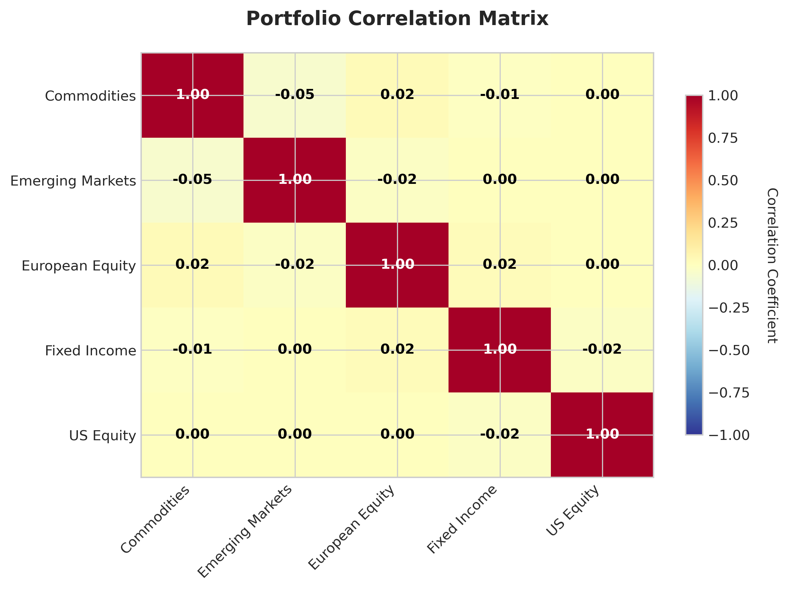

# RiskPlot

RiskPlot is a production-ready Python package designed for financial risk analysis and visualization. Built for risk managers, quantitative analysts, and financial researchers who need clear, accurate, and publication-quality charts.


## Quick Start

```bash
pip install riskplot
```

```python
import riskplot
import pandas as pd
import numpy as np

# Create sample data
data = pd.DataFrame({
    'category': ['A', 'B', 'C', 'D'],
    'values': np.random.normal(0, 1, 4)
})

# Create a ridge plot
fig, ax = riskplot.ridge_plot(data, 'category', 'values')
```

## Features

### Core Visualizations
- **Ridge Plots**: Distribution comparisons across categories
- **Heatmaps**: Correlation matrices and risk matrices
- **Waterfall Charts**: Risk attribution and P&L analysis
- **Time Series**: VaR tracking and drawdown analysis

### Advanced Visualizations
- **Network Plots**: Interaction networks between entities
- **Globe Visualizations**: Geographic risk distributions
- **Surface Plots**: 2D/3D risk landscapes

## 🎯 Use Cases

- **Financial Risk Management**: Portfolio risk analysis, VaR calculations
- **Country Risk Analysis**: Geographic risk assessment
- **Network Analysis**: Financial interconnectedness, trade relationships
- **Stress Testing**: Scenario analysis and surface optimization

## Visualization Gallery

### Distribution Analysis

*Compare return distributions across multiple portfolios*

### Correlation Analysis

*Portfolio correlation matrices with clear visual indicators*

### Attribution Analysis

*Return attribution across risk factors*

### Risk Monitoring

*Value-at-Risk and volatility tracking over time*

### Risk Assessment

*Probability vs impact risk assessment matrix*

### Performance Analysis

*Portfolio drawdown analysis and high water marks*

### Geographic Risk

*Country-level risk assessment and scoring*

## Installation

```bash
pip install riskplot
```

For specialized visualizations:
```bash
# Network analysis features
pip install riskplot[network]

# Interactive globe charts
pip install riskplot[globe]

# Complete feature set
pip install riskplot[all]
```

## 📚 Documentation

- [Getting Started Guide](guides/getting-started)
- [API Reference](api/)
- [Examples Gallery](examples/)
- [Advanced Features](guides/advanced-features)

## Contributing

Contributions are welcome. Please see our [Contributing Guide](https://github.com/OwenDinsmore/riskplot/blob/main/CONTRIBUTING.md) for guidelines.

## License

MIT License - see [LICENSE](https://github.com/OwenDinsmore/riskplot/blob/main/LICENSE) for details.

## Links

- [GitHub Repository](https://github.com/OwenDinsmore/riskplot)
- [PyPI Package](https://pypi.org/project/riskplot/)
- [Issue Tracker](https://github.com/OwenDinsmore/riskplot/issues)